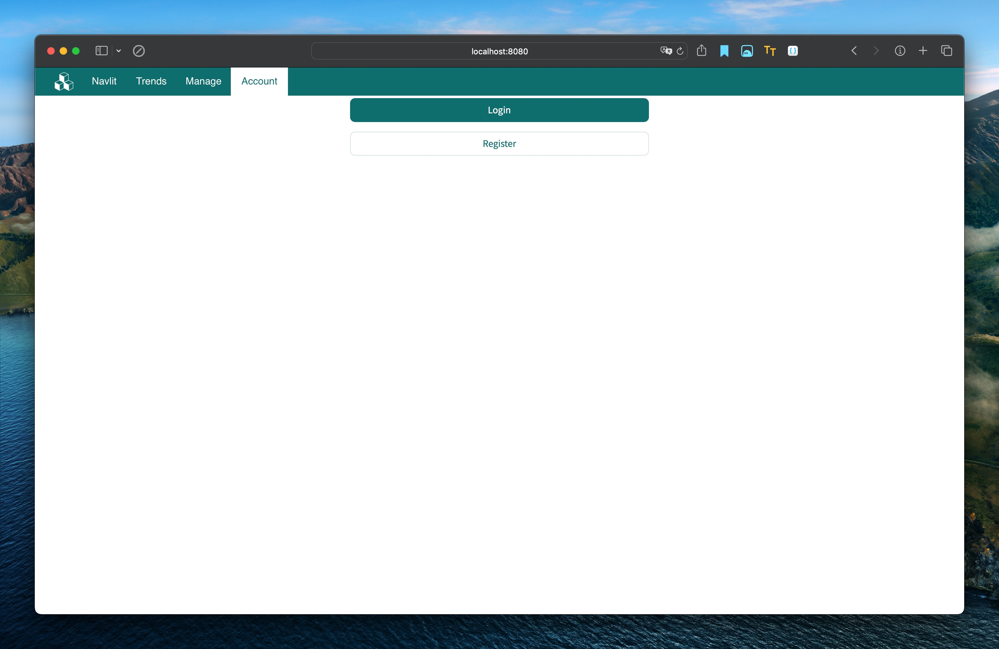

## Navlit

Simple, lightweight, and easy-to-use navigation service.

> [中文文档](README_CN.md)

### Key features

- Guest (no login required): 
  - Visit the navigation service homepage, browse and click on the site card to access the target site. 
  - Visit the Navigation Services Submissions page to edit the Submit Sitecard request, which will be reviewed later by an administrator. 
- Operator: 
  - Visit the navigation landing page as a guest, register or log in as an operator. 
  - Visit the navigation service homepage, browse and click on the site card to access the target site. 
  - Visit the homepage of the navigation service, browse and bookmark your favorite sites, and the site will be classified as a "favorites" category and displayed on the homepage as a category. 
    - You can click Unfavorite on the Favorites page, and the site will be displayed in the original category. 
  - Visit the Navigation Service Management page to create a site card, and then edit, activate/freeze, delete, and preview the site card created by yourself. 
    - Site cards created by operators do not need to be reviewed by the administrator, but only managed by the operators themselves. 
- Administrator: 
  - When the system is started for the first time, a user with the administrator role will be automatically initialized, and the administrator password can be changed through commands or databases. 
  - Site card management page, manage all site cards, support editing, activating/freezing, deleting, and previewing. 
  - Site Card Review page, which reviews site card applications submitted by visitors and approves or rejects them. 
  - User management page, manage all users, support password reset, deletion, or promotion to administrator. 
  - Operator registration review page, which reviews the operator user registration application, approved or rejected. 
- Trend Statistics: 
  - Trend statistics for all users to browse the navigation site. 
  - Total number of categories, total number of sites, cumulative historical visits, visits of this month, visits of the week, visits of the day, and number of users (including visitors). 
  - Monthly site visit curves 
  - Weekly site visit curves 
  - Daily site access curves 
  - TOP10 Visiting Sites 
  - TOP10 favorite sites
  - TOP10 Visitors

### Screenshots





### Develop

#### Dependencies Manage

```shell
poetry add streamlit
poetry update streamlit
poetry remove streamlit
```

#### Startup

```shell
streamlit run navapp/main.py
# or development mode
streamlit run navapp/main.py -- --env dev
```

#### Docker & Docker Compose

1. install python hook library

```shell
poetry add pre-commit --group dev
```

2. install the git hook scripts to current repository

```shell
pre-commit install
```

3. run pre-commit hook to export requirements.txt

```shell
pre-commit run --all-files
```

4. auto re-export before commit poetry

```shell
poetry add new_lib
poetry update
git add pyproject.toml poetry.lock
git commit -m "add new lib"
# auto export...
```

5. build docker image

```shell
docker build --network=host -t navlit .
docker build -t navlit .
docker run -p 8080:8080 navlit
```

6. startup docker container

```shell
docker-compose up -d
docker-compose down
```

### Acknowledgement

- streamlit
- streamlit-extras
- streamlit-navigation-bar
- loguru
- pillow
- peewee

### License

MIT
